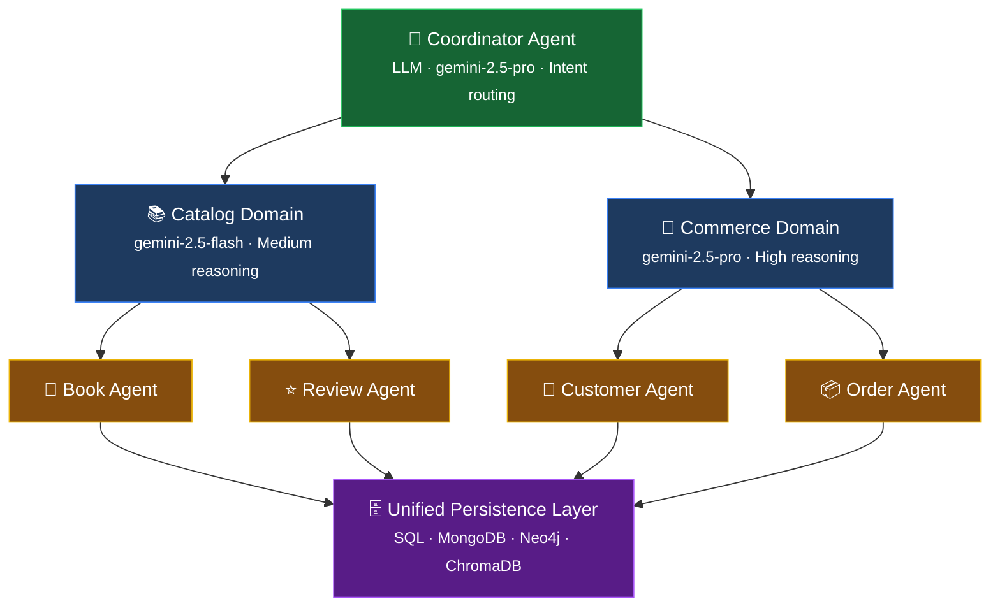

<p align="center">
  <h1 align="center">🥷 NinjaStack</h1>
  <p align="center">
    <strong>Schema-first agentic backend framework.</strong><br>
    Point at a database, get a full agentic backend with AI agents, GraphQL, auth, and UI.
  </p>
  <p align="center">
    <a href="https://codeninja.github.io/ninja-stack/">Homepage</a> ·
    <a href="https://codeninja.github.io/ninja-stack/docs/">Documentation</a> ·
    <a href="https://codeninja.github.io/ninja-stack/docs/examples/">Examples</a>
  </p>
</p>

---

## What is NinjaStack?

NinjaStack transforms database schemas into fully functional agentic backends. Define your data model once — through database introspection or conversational design — and the framework generates AI agents, GraphQL APIs, authentication, RBAC, and deployment manifests.

```bash
# Connect to your database, discover the schema
ninjastack introspect --db postgres://localhost/myapp

# Generate everything: models, agents, GraphQL, auth
ninjastack sync

# Run your agentic backend
ninjastack serve
# → Agentic backend at http://localhost:8000
# → GraphQL playground at /graphql
# → Agent chat at /chat
```

No database yet? Chat with the AI setup assistant to design your schema through natural dialogue:

```bash
ninjastack init --interactive
# "I need a bookstore with books, customers, orders, and reviews..."
```

## Key Features

| Feature | Description |
|---------|-------------|
| 🔍 **Database Introspection** | Auto-discover entities from PostgreSQL, MongoDB, Neo4j, or vector stores |
| 🤖 **ADK Agent Generation** | Google ADK agents with scoped CRUD tools per entity |
| 🧬 **Agentic Schema Definition** | Typed, composable schema language — your single source of truth |
| 🔐 **Auth & RBAC** | Pluggable auth (OAuth2, JWT, API keys) with declarative role-based permissions |
| 📊 **GraphQL Generation** | Strawberry types, queries, and mutations from schema |
| 💬 **Conversational Setup** | Design your schema through natural dialogue with Gemini |
| 🎯 **Tool Scoping** | Each agent only sees its own tools — no leaking across boundaries |
| 🚀 **K8s Deployment** | Helm charts and manifests generated automatically |
| 🔄 **Polyglot Persistence** | Unified layer across SQL, NoSQL, graph, and vector databases |

## Architecture

NinjaStack organizes agents in a three-tier hierarchy with explicit ownership at every level:



- **Data Agents** — Deterministic CRUD. No LLM. One entity, scoped tools. Fast and testable.
- **Domain Agents** — LLM-powered. Own a business domain. Delegate to data agents. Configurable reasoning.
- **Coordinator** — Top-level router. Classifies intent. Synthesizes cross-domain results.

> 📚 [Full architecture docs →](https://codeninja.github.io/ninja-stack/docs/architecture/)

## Quick Start

### Prerequisites

- Python 3.12+
- [uv](https://docs.astral.sh/uv/) package manager

### Install from source

```bash
git clone https://github.com/codeninja/ninja-stack.git
cd ninja-stack
uv sync
```

### Run the examples

All examples use a bookstore domain and work without any API keys:

```bash
# Schema definition
PYTHONPATH=examples/bookstore uv run python examples/bookstore/01_schema_definition.py

# Data agents (deterministic CRUD)
PYTHONPATH=examples/bookstore uv run python examples/bookstore/03_data_agents.py

# Full end-to-end pipeline
PYTHONPATH=examples/bookstore uv run python examples/bookstore/06_end_to_end.py
```

| # | Example | What It Demonstrates |
|---|---------|---------------------|
| 1 | [Schema Definition](examples/bookstore/01_schema_definition.py) | Entities, fields, relationships, domains |
| 2 | [Code Generation](examples/bookstore/02_code_generation.py) | Generate models, agents, GraphQL from schema |
| 3 | [Data Agents](examples/bookstore/03_data_agents.py) | Deterministic CRUD, tool scoping, tracing |
| 4 | [Domain Agents](examples/bookstore/04_domain_agents.py) | LLM-powered orchestration and delegation |
| 5 | [Auth & RBAC](examples/bookstore/05_auth_rbac.py) | Identity, JWT tokens, role-based permissions |
| 6 | [End-to-End](examples/bookstore/06_end_to_end.py) | Full pipeline: schema → agents → auth → query |

### Optional: Enable LLM features

Data agents, code generation, and RBAC work without an API key. For LLM-powered features (domain agents, conversational setup):

```bash
export GOOGLE_API_KEY="your-gemini-api-key"
```

## Project Structure

NinjaStack is a modular monorepo of 15 focused packages:

```
ninja-stack/
├── libs/                          # Reusable libraries
│   ├── ninja-core/                # ASD schema models (entity, domain, relationship)
│   ├── ninja-agents/              # ADK agents (DataAgent, DomainAgent, Coordinator)
│   ├── ninja-auth/                # Auth gateway, strategies, RBAC
│   ├── ninja-codegen/             # Jinja2 code generation engine
│   ├── ninja-introspect/          # Database schema discovery
│   ├── ninja-persistence/         # Unified polyglot persistence
│   ├── ninja-gql/                 # Strawberry GraphQL generation
│   ├── ninja-boundary/            # Data tolerance & coercion
│   ├── ninja-graph/               # Graph-RAG bootstrapper
│   ├── ninja-models/              # Pydantic model generation
│   ├── ninja-deploy/              # K8s/Helm deployment pipeline
│   ├── ninja-ui/                  # CRUD viewer & chat UI generation
│   └── ninja-cli/                 # CLI tooling
├── apps/                          # Deployable applications
│   ├── ninja-api/                 # FastAPI server
│   └── ninja-setup-assistant/     # Gemini-powered conversational setup
├── examples/                      # Bookstore walkthrough (6 examples)
├── docs/                          # MkDocs source
└── site/                          # Landing page + built docs
```

## Tech Stack

| Layer | Technology |
|-------|-----------|
| Language | Python 3.12+ · Pydantic v2 |
| Agents | Google ADK · LiteLLM (model-agnostic) |
| API | FastAPI · Strawberry GraphQL |
| Auth | JWT · OAuth2 · API Keys · bcrypt |
| Persistence | SQLAlchemy · Motor/Beanie · Neo4j · ChromaDB |
| Deploy | Kubernetes · Helm |
| Package Mgmt | uv |

## Contributing

### Setup

```bash
git clone https://github.com/codeninja/ninja-stack.git
cd ninja-stack
uv sync
```

### Run tests

```bash
# Full suite
uv run pytest

# Specific library
uv run pytest libs/ninja-core/
uv run pytest libs/ninja-agents/
uv run pytest libs/ninja-auth/

# With coverage
uv run pytest --cov
```

### Project conventions

- **Commits**: [Conventional Commits](https://www.conventionalcommits.org/) — `feat(ninja-agents): add tool scoping`
- **Branches**: `feat/issue-<N>-description` from `main`
- **PRs**: One feature per PR, linked to an issue
- **Tests**: Every library has its own test suite. All tests must pass before merge.
- **Code generation**: Templates live in `libs/ninja-codegen/src/ninja_codegen/templates/`
- **Adding a library**: Create under `libs/`, add to root `pyproject.toml` workspace members

### Build docs locally

```bash
uv run mkdocs serve
# → http://localhost:8000
```

## Links

- 🏠 **Homepage**: [codeninja.github.io/ninja-stack](https://codeninja.github.io/ninja-stack/)
- 📚 **Documentation**: [codeninja.github.io/ninja-stack/docs](https://codeninja.github.io/ninja-stack/docs/)
- 📖 **Examples**: [examples/bookstore/](examples/bookstore/)
- 🐛 **Issues**: [github.com/codeninja/ninja-stack/issues](https://github.com/codeninja/ninja-stack/issues)

## License

TBD
