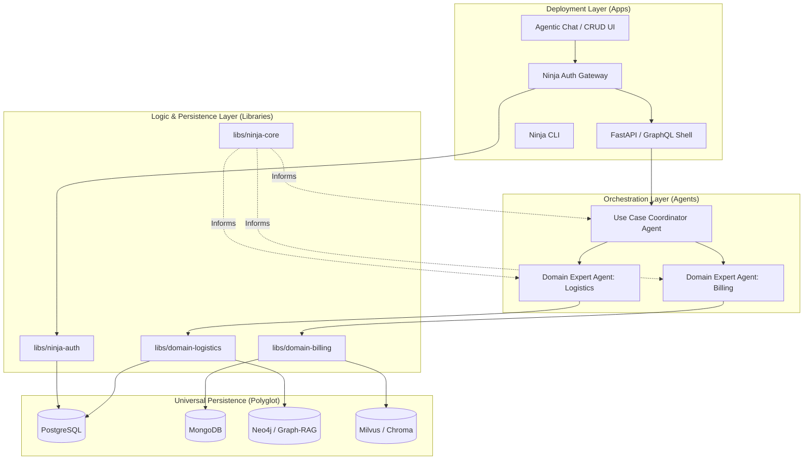

# Ninja Stack: Technical Blueprint & Architecture

## 1. System Philosophy
The Ninja Stack is a **Self-Assembling Agentic Framework**. It treats the **Agentic Schema Definition (ASD)** as the "DNA" of the project. From this DNA, the system generates a library-first monorepo where every domain is managed by a specialized agent.

---

## 2. Core Architecture

### A. System Diagram (Data Flow & Composition)

### B. Data Flow: The "Inverted Pyramid"
Data enters through a thin application layer and flows down through increasingly granular, deterministic libraries.

1.  **Request Layer (App Shell)**: FastAPI / GQL / CLI. No logic. Routes to a **Use Case Coordinator Agent**.
2.  **Orchestration Layer (Coordinator Agents)**: High-level reasoning. Breaks requests into domain-specific tasks.
3.  **Expert Layer (Domain Agents)**: Specialized ADK agents with domain-specific tools. They understand the "Graph" of their domain (e.g., how a `User` relates to `Billing`).
4.  **Persistence Layer (Data Agents/Libraries)**: Pure Pydantic + SQL/NoSQL/Graph/Vector connectors. These are deterministic experts.

### B. Agent Interface Pattern
Every agent in the Ninja Stack follows the **Tool-Scoped Interface**:
- **Expertise**: Defined by the ASD.
- **Tools**: Auto-generated from the Persistence Layer libraries.
- **Communication**: Uses Google ADK as the bus, targeting Gemini as the reasoning engine.

---

## 3. The ASD (Agentic Schema Definition)
The `.ninjastack/schema.json` is the source of truth. It defines:
- **Entities**: (e.g., `Order`) Fields, Types, Embeddings.
- **Expert Domains**: (e.g., `Logistics`) Which entities an agent "owns."
- **Relationships**: 
    - *Hard*: SQL Foreign Keys.
    - *Soft*: Semantic/Vector links.
    - *Graph*: Multi-hop relationship nodes.

---

## 4. Implementation Plan & Milestones

### Milestone 1: The Foundation (The "DNA" & CLI)
**Objective**: Build the core models and the CLI to manage them.
- **Ticket 1.1**: Implement ASD Pydantic Models (`libs/ninja-core`). Define Entities, Domains, and Agents.
- **Ticket 1.2**: Implement `ninjastack init` CLI. Spawns a Gemini-powered ADK agent to interview the user and write the initial `schema.json`.
- **Ticket 1.3**: Implement `.ninjastack/` state management (Config, Environment, Secrets).

### Milestone 2: The Generator (The "Sync" Engine)
**Objective**: Transform ASD into code.
- **Ticket 2.1**: Implement the **Polyglot Introspector**. Connect to DBs and produce a draft ASD.
- **Ticket 2.2**: Implement the **Library Scaffolder**. Generates `libs/domain-{name}` with Pydantic models and persistence logic.
- **Ticket 2.3**: Implement the **Agent Scaffolder**. Generates ADK-compatible `agent.yaml` and tool definitions for each Domain Agent.

### Milestone 3: The Persistence Layer (Polyglot & Graph-RAG)
**Objective**: Enable agents to actually "see" data.
- **Ticket 3.1**: Implement **Unified Persistence Wrapper** (SQL/NoSQL support).
- **Ticket 3.2**: Implement **Vector/Semantic Search Integration** as a first-class tool for all agents.
- **Ticket 3.3**: Implement **Graph-RAG Bootstrapper**. Automatically populate Neo4j based on ASD relationships.

### Milestone 5: The Ninja Auth Gateway
**Objective**: Secure the stack with a pluggable identity layer.
- **Ticket 5.1**: Implement `libs/ninja-auth` core. Define unified User/Session/Identity interfaces.
- **Ticket 5.2**: Implement Auth Strategy Modules:
    - `OAuth2Strategy` (Google/GitHub).
    - `BearerStrategy` (JWT/Auth0).
    - `IdentityStrategy` (User registration, login, password management).
- **Ticket 5.3**: Implement `NinjaAuthGateway`. A middleware/shell that sits in front of all agentic routes to enforce policy and context injection (who is the user?).

---

## 5. Agent-at-Every-Level (Internal Architecture)

- **The Setup Agent**: Expert in Ninja Stack architecture. Helps you build the project.
- **The Domain Agents**: Experts in their specific slice of the data. 
    - *Example*: `BillingAgent` has tools: `get_invoice`, `process_refund`, `search_billing_docs_semantic`.
- **The Coordinator Agent**: Expert in routing. 
    - *Example*: "My order is wrong" -> Routes to `OrderAgent` (to find it) + `SupportAgent` (to log ticket).

---

## 6. Execution Strategy
1.  Initialize **GitHub Repo**.
2.  Commit this **Technical Blueprint** to `docs/architecture.md`.
3.  Begin **Milestone 1, Ticket 1.1** (Core Models).
