# Agent Hierarchy

NinjaStack's agent architecture follows a strict three-tier hierarchy with explicit ownership boundaries.

## Overview

```mermaid
graph TD
    C[🎯 Coordinator Agent<br/>LlmAgent · gemini-2.5-pro]
    C --> D1[📚 Catalog Domain Agent<br/>LlmAgent · gemini-2.5-flash]
    C --> D2[🛒 Commerce Domain Agent<br/>LlmAgent · gemini-2.5-pro]
    D1 --> DA1[📖 Book Data Agent<br/>BaseAgent · No LLM]
    D1 --> DA2[⭐ Review Data Agent<br/>BaseAgent · No LLM]
    D2 --> DA3[👤 Customer Data Agent<br/>BaseAgent · No LLM]
    D2 --> DA4[📦 Order Data Agent<br/>BaseAgent · No LLM]

    style C fill:#166534,color:#fff
    style D1 fill:#1e3a5f,color:#fff
    style D2 fill:#1e3a5f,color:#fff
    style DA1 fill:#3d3d00,color:#fff
    style DA2 fill:#3d3d00,color:#fff
    style DA3 fill:#3d3d00,color:#fff
    style DA4 fill:#3d3d00,color:#fff
```



## Tier 1: Data Agents

Data agents are the workhorses. They extend ADK's `BaseAgent` and execute deterministic CRUD operations without any LLM calls.

```python
from ninja_agents.base import DataAgent

book_agent = DataAgent(entity=book_schema)
book_agent.execute("book_get", id="abc-123")  # Instant, deterministic
```

**Properties:**

- One agent per entity
- 6 auto-generated tools: `get`, `list`, `create`, `update`, `delete`, `search_semantic`
- Tool scoping: can only access its own entity's tools
- `uses_llm = False` (reasoning level NONE)
- Implements `_run_async_impl` for ADK Runner compatibility

## Tier 2: Domain Agents

Domain agents own a business domain (logical grouping of entities). They wrap ADK's `LlmAgent` and use Gemini for reasoning about cross-entity operations within their domain.

```python
from ninja_agents.base import DomainAgent

catalog = DomainAgent(
    domain=catalog_domain,
    data_agents=[book_agent, review_agent],
)
catalog.delegate("Book", "book_get", id="abc-123")
```

**Properties:**

- One agent per domain
- Sub-agents are the domain's data agents
- LLM-powered intent classification within the domain
- Configurable reasoning level and temperature
- Cannot access entities outside its domain

## Tier 3: Coordinator Agent

The coordinator is the top-level router. It classifies user intent and delegates to the appropriate domain agent(s).

```python
from ninja_agents.base import CoordinatorAgent

coordinator = CoordinatorAgent(domain_agents=[catalog, commerce])
coordinator.route("Find sci-fi books under $20", target_domains=["Catalog"])
```

**Properties:**

- Single instance per application
- Sub-agents are domain agents
- Uses highest reasoning level (gemini-2.5-pro)
- Can fan out to multiple domains for cross-domain queries
- Never executes tools directly

## Why Three Tiers?

| Concern | Solution |
|---------|----------|
| **Cost** | Data agents are free (no LLM). Only domain/coordinator agents burn tokens. |
| **Latency** | CRUD operations are instant. LLM only used for intent classification. |
| **Scope** | Each agent has a bounded tool set. No agent sees everything. |
| **Testability** | Data agents are fully deterministic and testable without mocks. |
| **Security** | RBAC enforcement at each tier. Unauthorized tools never execute. |
