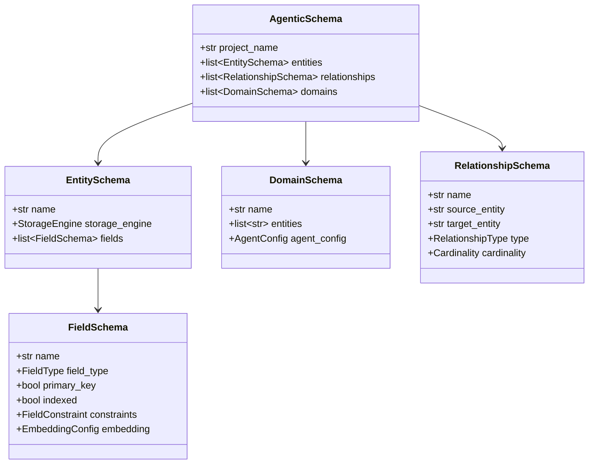

# Agentic Schema Definition (ASD)

The ASD is NinjaStack's schema language — a typed, composable definition of your entire data model, agent configuration, and domain boundaries.

## Schema Structure



## Entities

Entities map to tables (SQL), collections (Mongo), nodes (Graph), or vector stores.

```python
from ninja_core.schema.entity import EntitySchema, FieldSchema, FieldType, StorageEngine

book = EntitySchema(
    name="Book",
    storage_engine=StorageEngine.SQL,
    fields=[
        FieldSchema(name="id", field_type=FieldType.UUID, primary_key=True),
        FieldSchema(name="title", field_type=FieldType.STRING, indexed=True,
                    constraints=FieldConstraint(min_length=1, max_length=500)),
        FieldSchema(name="price", field_type=FieldType.FLOAT,
                    constraints=FieldConstraint(ge=0.0)),
    ],
)
```

### Field Types

| Type | Python Mapping | Description |
|------|---------------|-------------|
| `STRING` | `str` | Short text |
| `TEXT` | `str` | Long text (supports embedding) |
| `INTEGER` | `int` | Whole numbers |
| `FLOAT` | `float` | Decimal numbers |
| `BOOLEAN` | `bool` | True/False |
| `DATETIME` | `datetime` | Timestamp |
| `DATE` | `date` | Date only |
| `UUID` | `UUID` | Unique identifier |
| `JSON` | `dict` | Arbitrary JSON |
| `ARRAY` | `list` | Lists |
| `BINARY` | `bytes` | Binary data |
| `ENUM` | `str` | Constrained values |

### Embedding Config

Fields can be configured for vector embedding:

```python
FieldSchema(
    name="text",
    field_type=FieldType.TEXT,
    embedding=EmbeddingConfig(
        model="text-embedding-3-small",
        dimensions=1536,
        chunk_strategy="paragraph",
    ),
)
```

## Relationships

Three types of relationships between entities:

```python
from ninja_core.schema.relationship import RelationshipSchema, RelationshipType, Cardinality

# Hard FK relationship
RelationshipSchema(
    name="order_customer",
    source_entity="Order",
    target_entity="Customer",
    relationship_type=RelationshipType.HARD,
    cardinality=Cardinality.MANY_TO_ONE,
    source_field="customer_id",
    target_field="id",
)

# Semantic similarity
RelationshipSchema(
    name="similar_reviews",
    source_entity="Book",
    target_entity="Review",
    relationship_type=RelationshipType.SOFT,
    cardinality=Cardinality.MANY_TO_MANY,
)

# Graph edge
RelationshipSchema(
    name="authored_by",
    source_entity="Book",
    target_entity="Author",
    relationship_type=RelationshipType.GRAPH,
    cardinality=Cardinality.MANY_TO_ONE,
    edge_label="AUTHORED_BY",
)
```

## Domains

Domains group entities under a single expert agent:

```python
from ninja_core.schema.domain import DomainSchema
from ninja_core.schema.agent import AgentConfig, ReasoningLevel

catalog = DomainSchema(
    name="Catalog",
    entities=["Book", "Review"],
    agent_config=AgentConfig(
        model_name="gemini-2.5-flash",
        reasoning_level=ReasoningLevel.MEDIUM,
        temperature=0.7,
    ),
)
```

## Serialization

The full schema serializes to `.ninjastack/schema.json`:

```python
from ninja_core.serialization.io import save_schema, load_schema

save_schema(schema, ".ninjastack/schema.json")
loaded = load_schema(".ninjastack/schema.json")
```
