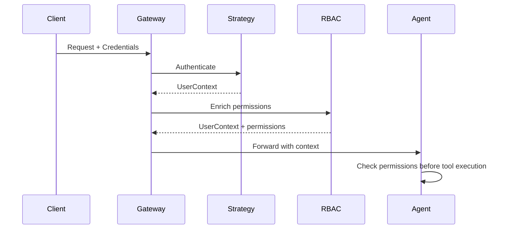

# Authentication & RBAC

NinjaStack provides pluggable authentication and declarative role-based access control.

## Auth Gateway

The auth gateway is a FastAPI middleware that authenticates requests and injects user context.



## Auth Strategies

| Strategy | Use Case | Credentials |
|----------|----------|-------------|
| **OAuth2** | User login (Google, GitHub) | Authorization code flow |
| **Bearer** | Token-based API access | JWT in `Authorization` header |
| **API Key** | Service-to-service | Key in header or query param |
| **Identity** | Built-in accounts | Email + password → JWT |

### Example: Identity Strategy

```python
from ninja_auth.config import IdentityConfig
from ninja_auth.strategies.identity import IdentityStrategy

identity = IdentityStrategy(config=IdentityConfig(
    token_secret="your-32-byte-secret-key-here!!!"
))

# Register
user = identity.register(email="alice@example.com", password="s3cur3!", roles=["customer"])

# Login
user = identity.login(email="alice@example.com", password="s3cur3!")

# Issue token
token = identity.issue_token(user)

# Validate
context = identity.validate_token(token)
```

## RBAC

Permissions use a string format: `action:scope`

### Permission Format

```
action:scope

Where:
  action = read | write | delete | *
  scope  = DomainName | DomainName.EntityName | *
```

### Examples

| Permission | Meaning |
|------------|---------|
| `read:Catalog` | Read any entity in the Catalog domain |
| `write:Catalog.Review` | Write only the Review entity |
| `delete:*` | Delete anything |
| `*:*` | Superuser — all actions, all scopes |

### Built-in Roles

| Role | Permissions |
|------|-------------|
| `admin` | `*:*` |
| `editor` | `read:*`, `write:*` |
| `viewer` | `read:*` |

### Custom Roles

```python
from ninja_auth.rbac import RBACConfig, RBACPolicy, RoleDefinition

policy = RBACPolicy(config=RBACConfig(roles={
    "customer": RoleDefinition(permissions=[
        "read:Catalog",
        "write:Catalog.Review",
        "read:Commerce.Order",
    ]),
}))

# Check
perms = policy.permissions_for_roles(["customer"])
policy.is_allowed(perms, "write", "Catalog", "Review")  # True
policy.is_allowed(perms, "write", "Catalog", "Book")     # False

# Enforce (raises PermissionError)
policy.check(perms, "delete", "Catalog", "Book")  # PermissionError!
```

## Agent Integration

Permission checks happen before tool execution:

```python
def protected_execute(agent, tool_name, user_roles, domain):
    action = "read" if tool_name.endswith(("_get", "_list")) else "write"
    perms = policy.permissions_for_roles(user_roles)

    if not policy.is_allowed(perms, action, domain, agent.entity.name):
        raise PermissionError(f"Denied: {action}:{domain}.{agent.entity.name}")

    return agent.execute(tool_name)
```
