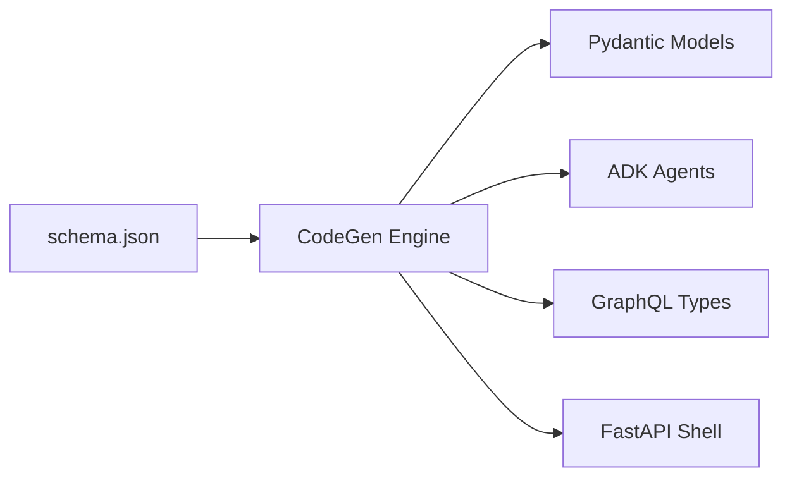

# Code Generation Pipeline

NinjaStack's code generation engine transforms an Agentic Schema Definition into runnable Python code.

## Pipeline



## How It Works

1. **Load** the ASD from `.ninjastack/schema.json`
2. **Run** Jinja2 templates for each generator
3. **Write** generated files to `_generated/` directory
4. **Diff** against existing files (only write if changed)

```python
from ninja_codegen.generators.models import generate_models
from ninja_codegen.generators.agents import generate_agents
from ninja_codegen.generators.graphql import generate_graphql

# Generate everything
model_paths = generate_models(schema.entities, output_dir)
agent_paths = generate_agents(schema.entities, schema.domains, output_dir)
gql_paths = generate_graphql(schema.entities, output_dir)
```

## Generated Output

### Models (`_generated/models/`)

One Pydantic model per entity with typed fields:

```python
# AUTO-GENERATED by ninja-codegen — DO NOT EDIT
class Book(BaseModel):
    id: UUID
    title: str
    author: str
    price: float
    genre: str
    published_date: date | None = None
    in_stock: bool = True
```

### Agents (`_generated/agents/`)

- **Data agents** — `DataAgent(entity=ENTITY)` per entity
- **Domain agents** — `DomainAgent(domain=DOMAIN, data_agents=[...])` per domain
- **Coordinator** — `CoordinatorAgent(domain_agents=[...])` top-level

### GraphQL (`_generated/graphql/`)

Strawberry types, inputs, queries, and mutations:

```python
# AUTO-GENERATED by ninja-codegen — DO NOT EDIT
@strawberry.type
class BookType:
    id: UUID
    title: str
    author: str
    price: float

@strawberry.type
class BookQuery:
    @strawberry.field
    def book(self, id: UUID) -> BookType: ...

    @strawberry.field
    def books(self) -> list[BookType]: ...
```

## Templates

Templates are Jinja2 files in `libs/ninja-codegen/src/ninja_codegen/templates/`:

| Template | Output |
|----------|--------|
| `model.py.j2` | Pydantic model class |
| `data_agent.py.j2` | ADK DataAgent instantiation |
| `domain_agent.py.j2` | ADK DomainAgent instantiation |
| `coordinator_agent.py.j2` | CoordinatorAgent wiring |
| `gql_type.py.j2` | Strawberry GraphQL type + resolvers |
| `app_shell.py.j2` | FastAPI application shell |

## Idempotent Generation

Running `ninjastack sync` multiple times produces identical output. The differ engine compares generated content against existing files and only writes when content has changed.
