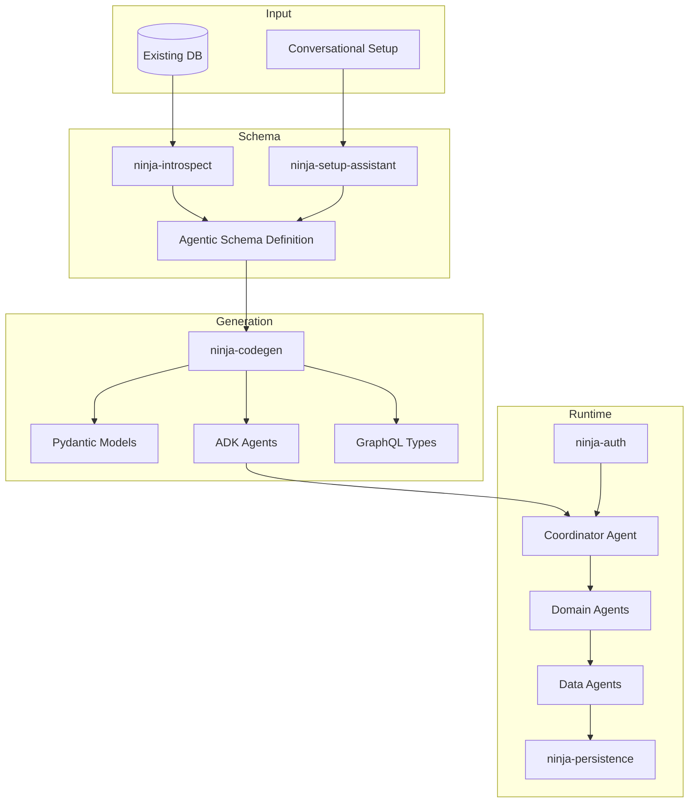

# Architecture

NinjaStack is a modular monorepo of 15 focused Python packages. Each package has a single responsibility and clear API boundaries.

## System Overview

## Package Map

| Package | Layer | Purpose |
|---------|-------|---------|
| `ninja-core` | Schema | ASD models (entity, domain, relationship, agent config) |
| `ninja-introspect` | Input | Database schema discovery |
| `ninja-codegen` | Generation | Jinja2 template engine for code generation |
| `ninja-agents` | Runtime | ADK agent classes (DataAgent, DomainAgent, Coordinator) |
| `ninja-auth` | Runtime | Auth gateway, strategies, RBAC |
| `ninja-gql` | Runtime | Strawberry GraphQL layer generation |
| `ninja-persistence` | Runtime | Unified polyglot persistence |
| `ninja-boundary` | Runtime | Data tolerance and coercion |
| `ninja-graph` | Runtime | Graph-RAG bootstrapper |
| `ninja-models` | Generation | Pydantic model generation |
| `ninja-deploy` | Deploy | Helm/K8s manifest generation |
| `ninja-ui` | Generation | CRUD viewer and chat UI generation |
| `ninja-cli` | CLI | `ninjastack` command-line interface |
| `ninja-api` | App | FastAPI server |
| `ninja-setup-assistant` | App | Gemini-powered conversational setup |

## Deep Dives

- [Agent Hierarchy](agent-hierarchy.md) — Three-tier agent architecture
- [Agentic Schema Definition](asd.md) — The schema language
- [Code Generation Pipeline](codegen.md) — How templates produce code
- [Auth & RBAC](auth-rbac.md) — Authentication and permission enforcement
- [Persistence Layer](persistence.md) — Polyglot database abstraction
