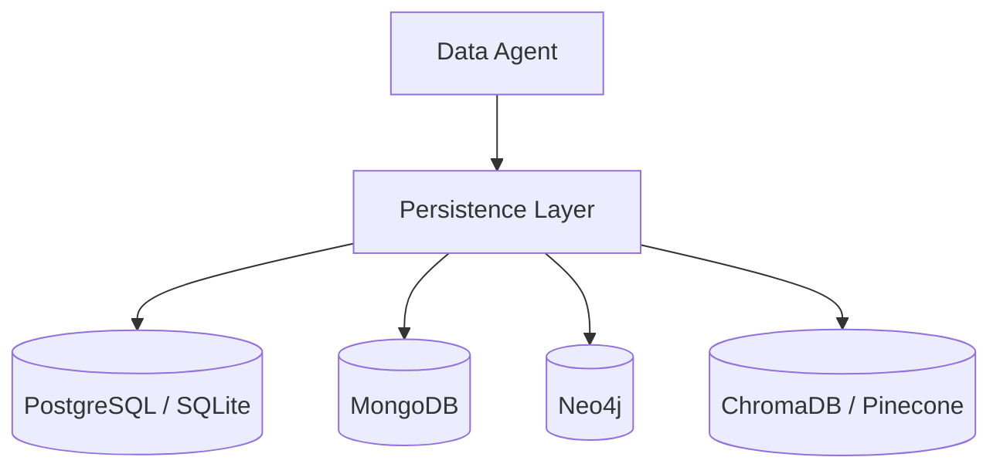

# Persistence Layer

NinjaStack's unified persistence layer routes operations to the correct database backend based on each entity's declared storage engine.

## Polyglot Architecture



## Storage Engines

Each entity declares its storage engine in the ASD:

```python
EntitySchema(
    name="Book",
    storage_engine=StorageEngine.SQL,  # or MONGO, GRAPH, VECTOR
    fields=[...],
)
```

| Engine | Backend | Best For |
|--------|---------|----------|
| `SQL` | PostgreSQL, SQLite | Structured relational data, transactions |
| `MONGO` | MongoDB | Document-oriented, flexible schemas |
| `GRAPH` | Neo4j | Relationship-heavy data, traversals |
| `VECTOR` | ChromaDB, Pinecone | Semantic search, embeddings |

## Mixed Storage

A single project can use multiple engines. For example:

- `Customer`, `Order` → SQL (transactional data)
- `Review` → SQL + Vector (text stored in SQL, embeddings in ChromaDB)
- `AuthorNetwork` → Graph (relationship traversals in Neo4j)

The persistence layer handles routing transparently. Data agents don't need to know which backend is in use.

## Configuration

Database connections are configured in `.ninjastack/persistence.json`:

```json
{
  "engines": {
    "sql": {
      "url": "postgresql://localhost/myapp",
      "pool_size": 10
    },
    "mongo": {
      "url": "mongodb://localhost:27017/myapp"
    },
    "graph": {
      "url": "neo4j://localhost:7687",
      "auth": {"user": "neo4j", "password": "..."}
    },
    "vector": {
      "provider": "chroma",
      "path": ".ninjastack/chroma_db"
    }
  }
}
```
