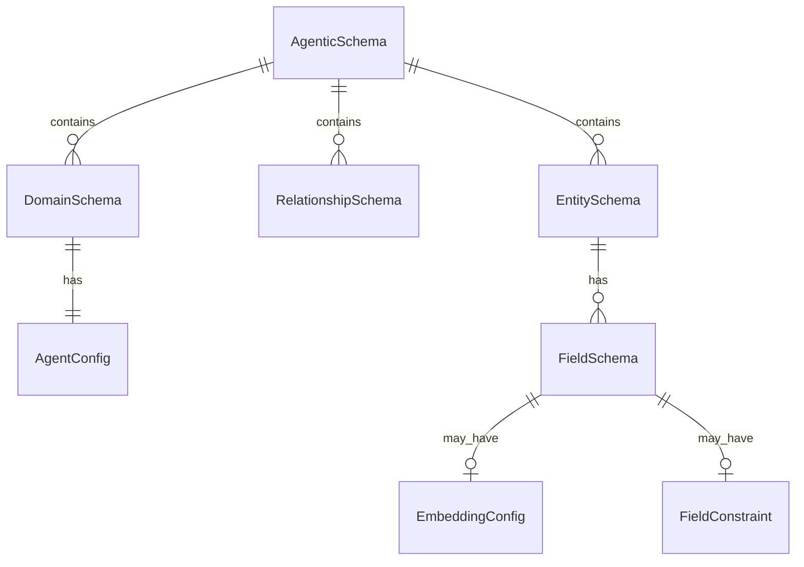

# Core Concepts

## Agentic Schema Definition (ASD)

The ASD is NinjaStack's single source of truth. It's a typed, composable schema that describes:

- **Entities** — Your data models (tables, collections, nodes)
- **Fields** — Typed columns with constraints, indexes, and embedding configs
- **Relationships** — Hard (FK), soft (semantic), and graph edges between entities
- **Domains** — Logical groupings of entities under one expert agent
- **Agent Configs** — Model, reasoning level, temperature per domain

## Agent Hierarchy

NinjaStack organizes agents in a three-tier hierarchy:

### Data Agents
- Extend ADK `BaseAgent`
- **Deterministic** — no LLM calls
- Own one entity, scoped CRUD tools
- Fast, predictable, testable

### Domain Agents
- Wrap ADK `LlmAgent`
- **LLM-powered** — use Gemini for reasoning
- Own one business domain (group of entities)
- Delegate to data agents for execution
- Configurable reasoning level (none → low → medium → high)

### Coordinator Agent
- Top-level ADK `LlmAgent`
- Routes requests to the right domain
- Synthesizes cross-domain results
- Intent classification via LLM

## Reasoning Levels

| Level | Model | Use Case |
|-------|-------|----------|
| `NONE` | — | Deterministic only (data agents) |
| `LOW` | gemini-2.0-flash | Simple completions |
| `MEDIUM` | gemini-2.5-flash | Multi-step reasoning |
| `HIGH` | gemini-2.5-pro | Full chain-of-thought |

## Tool Scoping

Every agent only sees its own tools. A Book data agent cannot call Customer tools. A Catalog domain agent cannot access Commerce entities. The coordinator routes across domains but never executes tools directly.

This prevents tool leaking, reduces hallucination surface, and enforces clear ownership boundaries.

## Storage Engines

Entities declare their storage engine:

| Engine | Backend | Use Case |
|--------|---------|----------|
| `SQL` | PostgreSQL, SQLite | Structured relational data |
| `MONGO` | MongoDB | Document-oriented data |
| `GRAPH` | Neo4j | Connected/relationship-heavy data |
| `VECTOR` | ChromaDB, Pinecone | Semantic search, embeddings |

The unified persistence layer handles routing to the correct backend.
