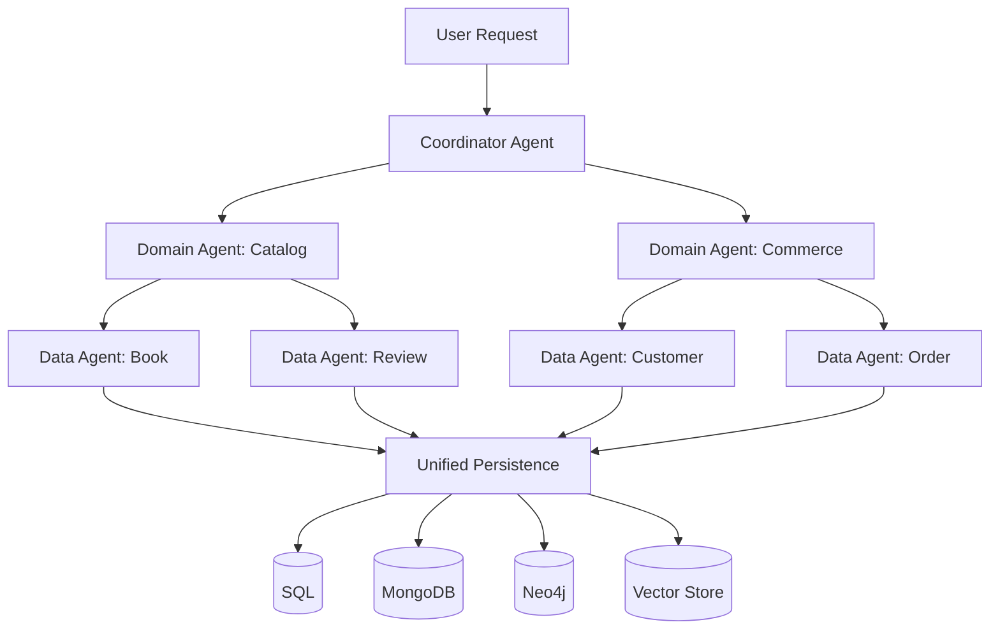

# NinjaStack

**Schema-first agentic backend framework.** Point at a database, get a full agentic backend.

NinjaStack auto-generates AI agents, GraphQL APIs, authentication, and UI from your data schema. Define once, generate everything.

## What is NinjaStack?

NinjaStack is a Python framework that transforms database schemas into fully functional agentic backends. Instead of hand-wiring agents, tools, permissions, and APIs, you define your data model once and the framework generates the entire stack.

```bash
# Connect to your database
ninjastack introspect --db postgres://localhost/myapp

# Generate everything
ninjastack sync

# Run your agentic backend
ninjastack serve
```

## Key Features

| Feature | Description |
|---------|-------------|
| 🔍 **Database Introspection** | Auto-discover entities from SQL, MongoDB, Neo4j, or vector stores |
| 🤖 **ADK Agent Generation** | Google ADK agents with scoped CRUD tools per entity |
| 🧬 **Agentic Schema Definition** | Typed, composable schema language — your single source of truth |
| 🔐 **Auth & RBAC** | Pluggable auth (OAuth2, JWT, API keys) with declarative permissions |
| 📊 **GraphQL Generation** | Strawberry types, queries, mutations from schema |
| 💬 **Conversational Setup** | Design your schema through natural dialogue with Gemini |
| 🎯 **Tool Scoping** | Each agent only sees its own tools — no leaking |
| 🚀 **K8s Deployment** | Helm charts generated automatically |
| 🔄 **Polyglot Persistence** | Unified layer across SQL, NoSQL, graph, and vector DBs |

## Architecture Overview



## Quick Links

<div class="grid cards" markdown>

- :material-rocket-launch: **[Getting Started](getting-started/index.md)** — Install and run your first agentic backend
- :material-sitemap: **[Architecture](architecture/index.md)** — Agent hierarchy, ASD, codegen pipeline
- :material-api: **[API Reference](api/index.md)** — Auto-generated from source docstrings
- :material-book-open-variant: **[Examples](examples/index.md)** — Bookstore walkthrough covering every layer

</div>

## Tech Stack

- **Python 3.12+** with Pydantic v2
- **Google ADK** for agent execution
- **FastAPI** for the API server
- **Strawberry** for GraphQL
- **LiteLLM** for model-agnostic LLM access
- **uv** for package management
